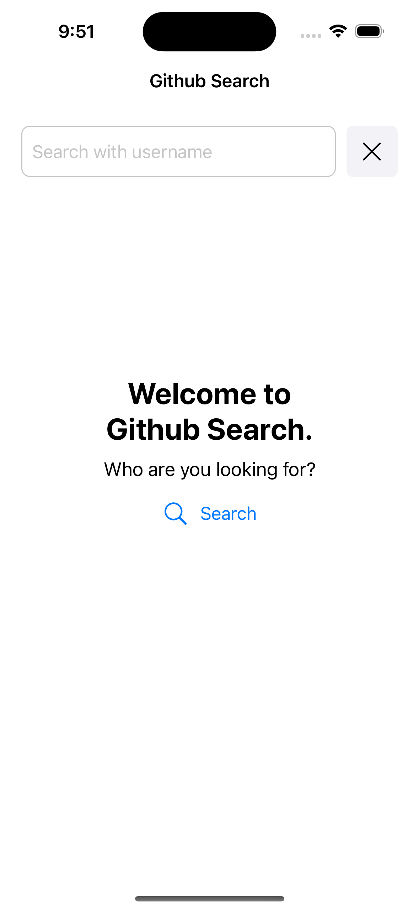
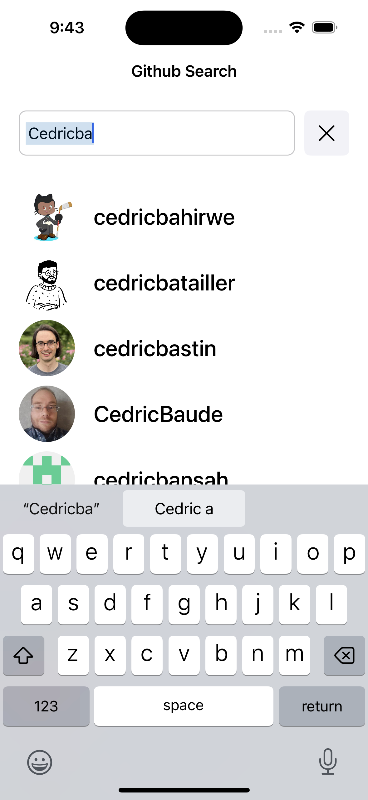
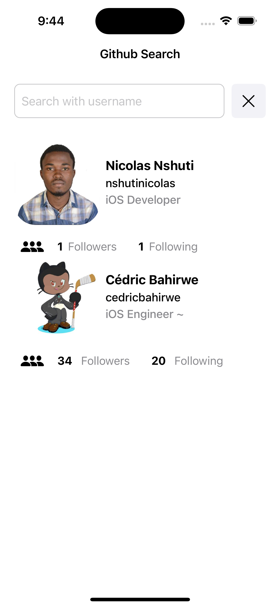

# Github Search

Github Search as I call it🥳, is an iOS app that utilises [Github User API](https://docs.github.com/en/rest/users/users?apiVersion=2022-11-28) to lookup users by their username.

### Framework

App is built in swift using UIKit as the UI framework and [RxSwift](https://github.com/ReactiveX/RxSwift) Package

### Installation

> Used SPM to add packages

- Clone the repo
- Open the project in xCode and build the app. if you run into package errors, resolve packages

### Architecture

The project architecture is built around `MVVM-C` with C being the coorindator

The coordinator handles the app flow throughtout and all coordinators should inherit from `BaseCoordinator`.

The project is built to be reactive with `RxSwift` which eliminates the usage of unnecessary delegates and NotificationCenter

The Views were programmatically written(no storyboard)

### Search Engine

This project exploits [Github public APIs](https://api.github.com) to query and search users

End points used:

- Search: `https://api.github.com/search/users?q={query}`
- Get users: `https://api.github.com/users`
- Get user by username: `https://api.github.com/users/{username}`
- Get user followers: `https://api.github.com/users/{username}/followers`
- Get user following: `https://api.github.com/users/{username}/following`

> I would advice to use postman or any other related tool to get the data structure

### Data persistence

`CoreData` is used to stored all the previously viewed profiles and they are available on the search page(SearchViewController)

### Unit tests

> 🚨 No unit test yet. Still resolving "Missing required module 'RxCocoaRuntime'" error in RxSwift. Possible solution is to use Cocoapods inplace of SPM but not sure yet.

In this Project, I adopted the `TDD(Test Driven Development)` method and testing is much more important going forward with this project.

All viewModels were written to make them easily testable.

### Screenshots

| **Empty Search View** | **Searching View** | **Search View** |
| --- | --- | --- |
|  |  |  |
